# Armor Reference

Generated from `server/static-data/metagameplay.json` and `server/static-data/ids.json`.

| IconImage | Tier | Name | Id | Health | WalkRange | ResistancePhysical | ResistanceMagic | ResistanceTech | SprintRange |
| --- | --- | --- | --- | --- | --- | --- | --- | --- | --- |
|  | 1 | Special Elemental Essence | Item_ElementalEssenceSpray1 | 0 | 1 | 0 | 0 | 0 | 3 |
|  | 1 | Used Ceramic Plating | Item_CeramicPlating1 | 0 | 0 | 5 | 0 | 0 | -1 |
| 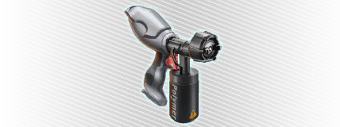 | 1 | Used Polymer Coating | Item_PolymerCoating1 | 0 | 0 | 2 | 1 | 1 | 0 |
| 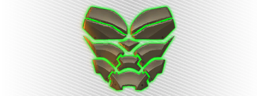 | 2 | Ceramic Plating | Item_CeramicPlating2 | 0 | 0 | 9 | 0 | 0 | -1 |
|  | 2 | Elemental Essence | Item_ElementalEssenceSpray2 | 3 | 1 | 0 | 0 | 0 | 2 |
| 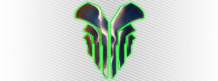 | 2 | Enchanted Biofiber | Item_EnchantedBiofiber2 | 0 | 0 | 2 | 5 | 0 | 0 |
| 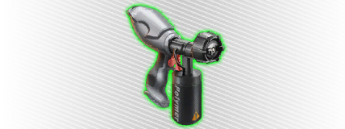 | 2 | Polymer Coating | Item_PolymerCoating2 | 0 | 0 | 5 | 3 | 3 | 0 |
| 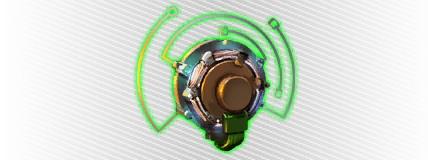 | 2 | Responsive  Filament | Item_ResponsiveECMFilaments2 | 0 | 0 | 2 | 0 | 5 | 0 |
|  | 3 | Impr. Ceramic Plating | Item_CeramicPlating3 | 0 | 0 | 16 | 0 | 2 | -1 |
|  | 3 | Impr. Elemental Essence | Item_ElementalEssenceSpray3 | 6 | 1 | 0 | 0 | 0 | 2 |
|  | 3 | Impr. Enchanted Biofiber | Item_EnchantedBiofiber3 | 0 | 0 | 5 | 7 | 0 | 0 |
| 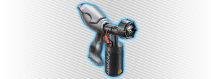 | 3 | Impr. Polymer Coating | Item_PolymerCoating3 | 0 | 0 | 9 | 4 | 4 | 0 |
|  | 3 | Impr. Responsive  Filament | Item_ResponsiveECMFilaments3 | 0 | 0 | 5 | 0 | 7 | 0 |
| 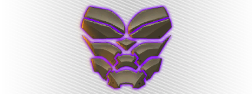 | 4 | SOTA Ceramic Plating | Item_CeramicPlating4 | 0 | 0 | 21 | 0 | 5 | -2 |
|  | 4 | SOTA Elemental Essence | Item_ElementalEssenceSpray4 | 10 | 1 | 0 | 0 | 0 | 2 |
| 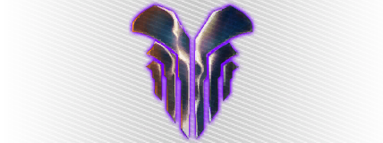 | 4 | SOTA Enchanted Biofiber | Item_EnchantedBiofiber4 | 0 | 0 | 9 | 12 | 0 | 0 |
| 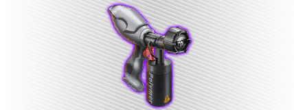 | 4 | SOTA Polymer Coating | Item_PolymerCoating4 | 0 | 0 | 11 | 5 | 5 | 0 |
| 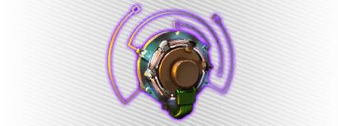 | 4 | SOTA Responsive Filament | Item_ResponsiveECMFilaments4 | 0 | 0 | 9 | 0 | 12 | 0 |
|  | 5 | Prototype Ceramic Plating | Item_CeramicPlating5 | 0 | 0 | 34 | 0 | 7 | -1 |
|  | 5 | Prototype Elemental Essence | Item_ElementalEssenceSpray5 | 24 | 0 | 0 | 0 | 0 | 1 |
|  | 5 | Prototype Enchanted Biofiber | Item_EnchantedBiofiber5 | 0 | 0 | 16 | 26 | 0 | 0 |
|  | 5 | Prototype Polymer Coating | Item_PolymerCoating5 | 0 | 0 | 15 | 12 | 12 | 0 |
|  | 5 | Prototype Responsive Filament | Item_ResponsiveECMFilaments5 | 0 | 0 | 15 | 0 | 26 | 0 |
|  | 6 | Superior Ceramic Plating | Item_CeramicPlating6 | 0 | -1 | 28 | 0 | 9 | -2 |
|  | 6 | Superior Elemental Essence | Item_ElementalEssenceSpray6 | 14 | 1 | 0 | 0 | 0 | 2 |
|  | 6 | Superior Enchanted Biofiber | Item_EnchantedBiofiber6 | 0 | 0 | 15 | 20 | 0 | 0 |
| 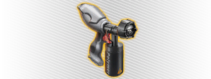 | 6 | Superior Polymer Coating | Item_PolymerCoating6 | 0 | 0 | 15 | 8 | 8 | 0 |
|  | 6 | Superior Responsive ECM Filaments | Item_ResponsiveECMFilaments6 | 0 | 0 | 15 | 0 | 20 | 0 |
|  | 7 | Elite Ceramic Plating | Item_CeramicPlating7 | 0 | -1 | 32 | 0 | 12 | -2 |
|  | 7 | Elite Elemental Essence | Item_ElementalEssenceSpray7 | 19 | 1 | 0 | 0 | 0 | 2 |
|  | 7 | Elite Enchanted Biofiber | Item_EnchantedBiofiber7 | 0 | 0 | 17 | 24 | 0 | 0 |
|  | 7 | Elite Polymer Coating | Item_PolymerCoating7 | 0 | 0 | 17 | 10 | 10 | 0 |
|  | 7 | Elite Responsive ECM Filaments | Item_ResponsiveECMFilaments7 | 0 | 0 | 17 | 0 | 23 | 0 |
|  | 8 | MilTec Ceramic Plating | Item_CeramicPlating8 | 0 | -1 | 37 | 0 | 10 | -2 |
|  | 8 | MilTec Elemental Essence | Item_ElementalEssenceSpray8 | 24 | 1 | 0 | 0 | 0 | 2 |
|  | 8 | MilTec Enchanted Biofiber | Item_EnchantedBiofiber8 | 0 | 0 | 17 | 30 | 0 | 0 |
|  | 8 | MilTec Polymer Coating | Item_PolymerCoating8 | 0 | 0 | 17 | 12 | 12 | 0 |
|  | 8 | MilTec Responsive ECM Filaments | Item_ResponsiveECMFilaments8 | 0 | 0 | 17 | 0 | 30 | 0 |
|  |  | Backer Talisman | Item_BackerTalisman | 5 | 0 | 0 | 0 | 0 | 0 |
|  |  | No armor | Item_EmptyArmor | 0 | 0 | 0 | 0 | 0 | 0 |
