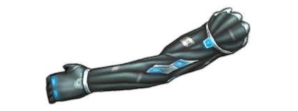

# Cyberware Reference

Generated from `server/static-data/metagameplay.json` and `server/static-data/ids.json`.

## Legs

| IconImage | Tier | Name | Id | Health | WalkRange | CriticalChance | ResistancePhysical | SprintRange | DemolishLevel | Essence |
| --- | --- | --- | --- | --- | --- | --- | --- | --- | --- | --- |
|  | 1 | Cyberlegs α | Item_Cyberware_Cyberlegs_1_Alpha | 1 | 0 | 0 | 0 | 1 | 0 | -2 |
|  | 1 | Cyberlegs β | Item_Cyberware_Cyberlegs_1_Beta | 1 | 0 | 0 | 0 | 1 | 0 | -1 |
|  | 1 | Glandular Implants α | Item_Cyberware_GlandularImplants_1_Alpha | 1 | -1 | 0.03 | 0 | -2 | 0 | -2 |
|  | 1 | Glandular Implants β | Item_Cyberware_GlandularImplants_1_Beta | 1 | -1 | 0.03 | 0 | -2 | 0 | -1 |
|  | 2 | Impr. Cyberlegs α | Item_Cyberware_Cyberlegs_2_Alpha | 2 | 0 | 0 | 0 | 2 | 0 | -3 |
|  | 2 | Impr. Cyberlegs β | Item_Cyberware_Cyberlegs_2_Beta | 2 | 0 | 0 | 0 | 2 | 0 | -2 |
|  | 2 | Impr. Glandular Implants α | Item_Cyberware_GlandularImplants_2_Alpha | 2 | -1 | 0.05 | 0 | -2 | 0 | -3 |
|  | 2 | Impr. Glandular Implants β | Item_Cyberware_GlandularImplants_2_Beta | 2 | -1 | 0.05 | 0 | -2 | 0 | -2 |
|  | 3 | SOTA Cyberlegs α | Item_Cyberware_Cyberlegs_3_Alpha | 3 | 1 | 0 | 0 | 2 | 0 | -3 |
|  | 3 | SOTA Cyberlegs β | Item_Cyberware_Cyberlegs_3_Beta | 3 | 1 | 0 | 0 | 2 | 10 | -2 |
|  | 3 | SOTA Glandular Implants α | Item_Cyberware_GlandularImplants_3_Alpha | 3 | -1 | 0.07 | 0 | -2 | 10 | -3 |
|  | 3 | SOTA Glandular Implants β | Item_Cyberware_GlandularImplants_3_Beta | 3 | -1 | 0.07 | 0 | -2 | 10 | -2 |
|  | 4 | Superior Cyberlegs | Item_Cyberware_Cyberlegs_4_Alpha | 5 | 1 | 0 | 3 | 2 | 10 | -3 |
|  | 4 | Superior Glandular Implants | Item_Cyberware_Glandularimplants_4_Alpha | 3 | -1 | 0.1 | 0 | -2 | 10 | -3 |
|  | 5 | Deltaware Cyberlegs | Item_Cyberware_Cyberlegs_5_Delta | 5 | 1 | 0 | 3 | 2 | 15 | -1 |
|  | 5 | Deltaware Glandular Implants | Item_Cyberware_Glandularimplants_5_Delta | 3 | -1 | 0.07 | 0 | -2 | 15 | -1 |
|  | 5 | Elite Cyberlegs | Item_Cyberware_Cyberlegs_5_Alpha | 7 | 1 | 0 | 5 | 2 | 15 | -2 |
|  | 5 | Elite Glandular Implants | Item_Cyberware_Glandularimplants_5_Alpha | 5 | 0 | 0.1 | 0 | -1 | 20 | -2 |
|  | 6 | MilTec Cyberlegs | Item_Cyberware_Cyberlegs_6_Alpha | 8 | 1 | 0 | 7 | 2 | 15 | -2 |
|  | 6 | MilTec Glandular Implants | Item_Cyberware_Glandularimplants_6_Alpha | 7 | -1 | 0.12 | 0 | -2 | 15 | -2 |
|  | 7 | Prototype Cyberlegs | Item_Cyberware_Cyberlegs_7_Alpha | 10 | 1 | 0 | 9 | 2 | 20 | -2 |
|  | 7 | Prototype Glandular Implants | Item_Cyberware_Glandularimplants_7_Alpha | 7 | 0 | 0.12 | 0 | -1 | 10 | -2 |
|  |  | Bioware Legs | Item_Cyberware_Bioware_Legs | 2 | 0 | 0 | 0 | 1 | 0 | 0 |
|  |  | Improved Leg Muscles | Item_Cyberware_BoostedBioware_Legs | 3 | 1 | 0 | 0 | 1 | 10 | 0 |

## Torso

| IconImage | Tier | Name | Id | Health | WalkRange | MaximumChanceToHit | ResistancePhysical | ResistanceTech | SprintRange | ToHitModifier | CriticalDamageMultiplier | Essence |
| --- | --- | --- | --- | --- | --- | --- | --- | --- | --- | --- | --- | --- |
|  | 1 | Bone Density | Item_Cyberware_Bioware_1_Alpha | 2 | 0 | 0 | 0 | 0 | 0 | 0 | 0 | 0 |
|  | 1 | Dermal Plating α | Item_Cyberware_Dermal_Plating_1_Alpha | 1 | 0 | 0 | 1 | 1 | -1 | 0 | 0 | -2 |
|  | 1 | Dermal Plating β | Item_Cyberware_Dermal_Plating_1_Beta | 1 | 0 | 0 | 1 | 1 | -1 | 0 | 0 | -1 |
|  | 1 | Wired Reflexes α | Item_Cyberware_Wired_Reflexes_1_Alpha | 0 | 0 | 0 | 0 | 0 | 1 | -0.03 | 0.05 | -2 |
|  | 1 | Wired Reflexes β | Item_Cyberware_Wired_Reflexes_1_Beta | 0 | 0 | 0 | 0 | 0 | 1 | -0.03 | 0.05 | -1 |
|  | 2 | Impr. Dermal Plating α | Item_Cyberware_Dermal_Plating_2_Alpha | 2 | 0 | 0 | 3 | 3 | -1 | 0 | 0 | -3 |
|  | 2 | Impr. Dermal Plating β | Item_Cyberware_Dermal_Plating_2_Beta | 2 | 0 | 0 | 3 | 3 | -1 | 0 | 0 | -2 |
|  | 2 | Impr. Wired Reflexes α | Item_Cyberware_Wired_Reflexes_2_Alpha | 0 | 0 | 0 | 0 | 0 | 1 | -0.03 | 0.07 | -3 |
|  | 2 | Impr. Wired Reflexes β | Item_Cyberware_Wired_Reflexes_2_Beta | 0 | 0 | 0 | 0 | 0 | 1 | -0.03 | 0.07 | -2 |
|  | 2 | Muscle Toner | Item_Cyberware_Bioware_2_Alpha | 0 | 0 | 0.04 | 0 | 0 | 0 | 0 | 0 | 0 |
|  | 3 | SOTA Dermal Plating α | Item_Cyberware_Dermal_Plating_3_Alpha | 4 | 0 | 0 | 5 | 4 | -1 | 0 | 0 | -3 |
|  | 3 | SOTA Dermal Plating β | Item_Cyberware_Dermal_Plating_3_Beta | 4 | 0 | 0 | 5 | 4 | -1 | 0 | 0 | -2 |
|  | 3 | SOTA Wired Reflexes α | Item_Cyberware_Wired_Reflexes_3_Alpha | 0 | 0 | 0 | 0 | 0 | 2 | -0.03 | 0.07 | -3 |
|  | 3 | SOTA Wired Reflexes β | Item_Cyberware_Wired_Reflexes_3_Beta | 0 | 0 | 0 | 0 | 0 | 2 | -0.03 | 0.07 | -2 |
|  | 4 | Superior Dermal Plating | Item_Cyberware_Dermal_Plating_4_Alpha | 8 | -1 | 0 | 8 | 6 | -2 | 0 | 0 | -3 |
|  | 4 | Superior Wired Reflexes | Item_Cyberware_Wired_Reflexes_4_Alpha | 0 | 1 | 0 | 0 | 0 | 2 | -0.03 | 0.1 | -3 |
|  | 5 | Deltaware Dermal Plating | Item_Cyberware_Dermal_Plating_5_Delta | 4 | 0 | 0 | 5 | 4 | -1 | 0 | 0 | -1 |
|  | 5 | Deltaware Wired Reflexes | Item_Cyberware_Wired_Reflexes_5_Delta | 0 | 1 | 0 | 0 | 0 | 2 | -0.03 | 0.07 | -1 |
|  | 5 | Elite Dermal Plating | Item_Cyberware_Dermal_Plating_5_Alpha | 9 | -1 | 0 | 10 | 7 | -2 | 0 | 0 | -2 |
|  | 5 | Elite Wired Reflexes | Item_Cyberware_Wired_Reflexes_5_Alpha | 0 | 1 | 0 | 0 | 0 | 2 | -0.03 | 0.12 | -2 |
|  | 6 | MilTec Dermal Plating | Item_Cyberware_Dermal_Plating_6_Alpha | 10 | -1 | 0 | 15 | 9 | -2 | 0 | 0 | -2 |
|  | 6 | MilTec Wired Reflexes | Item_Cyberware_Wired_Reflexes_6_Alpha | 0 | 1 | 0 | 0 | 0 | 2 | -0.05 | 0.15 | -2 |
|  | 7 | Prototype Dermal Plating | Item_Cyberware_Dermal_Plating_7_Alpha | 10 | -1 | 0 | 15 | 15 | -1 | 0 | 0 | -2 |
|  | 7 | Prototype Wired Reflexes | Item_Cyberware_Wired_Reflexes_7_Alpha | 0 | 1 | 0 | 0 | 0 | 3 | -0.05 | 0.15 | -2 |
|  |  | Bioware Torso | Item_Cyberware_Bioware_Torso | 3 | 0 | 0 | 2 | 0 | 0 | 0 | 0 | 0 |
|  |  | Increased Bones Density | Item_Cyberware_BoostedBioware_Torso | 7 | 0 | 0 | 0 | 0 | 0 | 0 | 0 | 0 |

## Head

| IconImage | Tier | Name | Id | MaximumChanceToHit | CriticalChance | HackingLevel | CriticalDamageMultiplier | SummonPowerCombatSoft | Essence | SummonPowerECMSoft |
| --- | --- | --- | --- | --- | --- | --- | --- | --- | --- | --- |
|  | 1 | Bioware Reflex Recorder | Item_Cyberware_Cultural_Bioware_Reflex_Recorder_1_Alpha | 0.05 | 0.02 | 0 | 0 | 0 | 0 | 0 |
|  | 1 | Boosted Commlink α | Item_Cyberware_BoostedComlink_1_Alpha | 0 | 0.05 | 10 | 0.03 | 0 | -2 | 0 |
|  | 1 | Boosted Commlink β | Item_Cyberware_BoostedComlink_1_Beta | 0 | 0.05 | 10 | 0.03 | 0 | -1 | 0 |
|  | 1 | Cranial Remote α | Item_Cyberware_CranialRemote_1_Alpha | 0.03 | 0 | 0 | 0.01 | 1 | -2 | 1 |
|  | 1 | Cranial Remote β | Item_Cyberware_CranialRemote_1_Beta | 0.03 | 0 | 0 | 0.01 | 1 | -1 | 1 |
|  | 1 | Impr. Vision Magnification α | Item_Cyberware_VisionMagnification_1_Alpha | 0.05 | 0.02 | 0 | 0 | 0 | -3 | 0 |
|  | 1 | Impr. Vision Magnification β | Item_Cyberware_VisionMagnification_1_Beta | 0.05 | 0.02 | 0 | 0 | 0 | -2 | 0 |
|  | 2 | Deltaware Comlink | Item_Cyberware_BoostedComlink_2_Delta | 0 | 0.05 | 15 | 0.03 | 3 | -1 | 1 |
|  | 2 | Impr. Cranial Remote α | Item_Cyberware_CranialRemote_2_Alpha | 0.03 | 0 | 5 | 0.03 | 2 | -3 | 2 |
|  | 2 | Impr. Cranial Remote β | Item_Cyberware_CranialRemote_2_Beta | 0.03 | 0 | 5 | 0.03 | 2 | -2 | 2 |
|  | 2 | Improved Boosted Comlink | Item_Cyberware_BoostedComlink_2_Alpha | 0 | 0.05 | 15 | 0.05 | 3 | -3 | 1 |
|  | 2 | SOTA Vision Magnification α | Item_Cyberware_VisionMagnification_2_Alpha | 0.07 | 0.03 | 0 | 0 | 0 | -3 | 0 |
|  | 2 | SOTA Vision Magnification β | Item_Cyberware_VisionMagnification_2_Beta | 0.07 | 0.03 | 0 | 0 | 0 | -2 | 0 |
|  | 3 | SOTA Boosted Comlink | Item_Cyberware_BoostedComlink_3_Alpha | 0 | 0.05 | 15 | 0.07 | 5 | -2 | 2 |
|  | 3 | SOTA Cranial Remote α | Item_Cyberware_CranialRemote_3_Alpha | 0.03 | 0 | 5 | 0.05 | 3 | -3 | 3 |
|  | 3 | SOTA Cranial Remote β | Item_Cyberware_CranialRemote_3_Beta | 0.03 | 0 | 5 | 0.05 | 3 | -2 | 3 |
|  | 3 | Superior Vision Magnification | Item_Cyberware_VisionMagnification_3_Alpha | 0.07 | 0.05 | 0 | 0 | 0 | -3 | 0 |
|  | 4 | Deltaware Vision Magnification | Item_Cyberware_VisionMagnification_4_Delta | 0.07 | 0.03 | 0 | 0 | 0 | -1 | 0 |
|  | 4 | Elite Vision Magnification | Item_Cyberware_VisionMagnification_4_Alpha | 0.1 | 0.07 | 0 | 0 | 0 | -2 | 0 |
|  | 4 | Prototype Boosted Comlink | Item_Cyberware_BoostedComlink_4_Alpha | 0 | 0.07 | 20 | 0.09 | 8 | -2 | 3 |
|  | 4 | Superior Cranial Remote | Item_Cyberware_CranialRemote_4_Alpha | 0.03 | 0 | 10 | 0.1 | 3 | -2 | 5 |
|  | 5 | Deltaware Cranial Remote | Item_Cyberware_CranialRemote_5_Delta | 0.03 | 0 | 5 | 0.05 | 3 | -1 | 3 |
|  | 5 | Elite Cranial Remote | Item_Cyberware_CranialRemote_5_Alpha | 0.05 | 0 | 10 | 0.12 | 3 | -2 | 5 |
|  | 5 | MilTec Vision Magnification | Item_Cyberware_VisionMagnification_5_Alpha | 0.15 | 0.07 | 0 | 0 | 0 | -2 | 0 |
|  | 6 | MilTec Cranial Remote | Item_Cyberware_CranialRemote_6_Alpha | 0.05 | 0 | 10 | 0.15 | 3 | -2 | 5 |
|  | 6 | Prototype Vision Magnification | Item_Cyberware_VisionMagnification_6_Alpha | 0.15 | 0.1 | 0 | 0 | 0 | -2 | 0 |
|  | 7 | Prototype Cranial Remote | Item_Cyberware_CranialRemote_7_Alpha | 0.05 | 0 | 10 | 0.17 | 3 | -2 | 7 |
|  |  | Bioware Comlink | Item_Cyberware_BoostedBioware_Head | 0 | 0.05 | 10 | 0.05 | 0 | 0 | 0 |
|  |  | Cranial Bioware | Item_Cyberware_Bioware_Head | 0 | 0 | 0 | 0.03 | 0 | 0 | 0 |

## Arms

| IconImage | Tier | Name | Id | MaximumChanceToHit | ResistancePhysical | Range | OrganHarvestingLevel | LockpickingLevel | RelativeDamageModifier | CriticalDamageMultiplier | Essence |
| --- | --- | --- | --- | --- | --- | --- | --- | --- | --- | --- | --- |
|  | 1 | 2nd Hand Reinforced Cyberarm α | Item_Cyberware_ReinforcedCyberarm_1_Alpha | 0 | 2 | 0 | 5 | 0 | 0.05 | 0 | -2 |
|  | 1 | 2nd Hand Reinforced Cyberarm β | Item_Cyberware_ReinforcedCyberarm_1_Beta | 0 | 2 | 0 | 5 | 0 | 0.05 | 0 | -1 |
|  | 1 | 2nd Hand Stabilized Cyberarm α | Item_Cyberware_StabilisedCyberarm_1_Alpha | 0 | 0 | 1 | 0 | 5 | 0 | 0 | -2 |
|  | 1 | 2nd Hand Stabilized Cyberarm β | Item_Cyberware_StabilisedCyberarm_1_Beta | 0 | 0 | 1 | 0 | 5 | 0 | 0 | -1 |
|  | 2 | Reinforced Cyberarm α | Item_Cyberware_ReinforcedCyberarm_2_Alpha | 0 | 3 | 0 | 10 | 0 | 0.07 | 0 | -2 |
|  | 2 | Reinforced Cyberarm β | Item_Cyberware_ReinforcedCyberarm_2_Beta | 0 | 3 | 0 | 10 | 0 | 0.07 | 0 | -1 |
|  | 2 | Stabilized Cyberarms α | Item_Cyberware_StabilisedCyberarm_2_Alpha | 0.05 | 0 | 1 | 0 | 10 | 0 | 0 | -2 |
|  | 2 | Stabilized Cyberarms β | Item_Cyberware_StabilisedCyberarm_2_Beta | 0.05 | 0 | 1 | 0 | 10 | 0 | 0 | -1 |
|  | 3 | Impr. Reinforced Cyberarms α | Item_Cyberware_ReinforcedCyberarm_3_Alpha | 0 | 4 | 0 | 15 | 0 | 0.1 | 0 | -3 |
|  | 3 | Impr. Reinforced Cyberarms β | Item_Cyberware_ReinforcedCyberarm_3_Beta | 0 | 4 | 0 | 15 | 0 | 0.1 | 0 | -2 |
|  | 3 | Impr. Stabilized Cyberarms α | Item_Cyberware_StabilisedCyberarm_3_Alpha | 0.05 | 0 | 2 | 0 | 15 | 0 | 0 | -3 |
|  | 3 | Impr. Stabilized Cyberarms β | Item_Cyberware_StabilisedCyberarm_3_Beta | 0.05 | 0 | 2 | 0 | 15 | 0 | 0 | -2 |
|  | 4 | SOTA Reinforced Cyberarms α | Item_Cyberware_ReinforcedCyberarm_4_Alpha | 0 | 6 | 0 | 20 | 0 | 0.1 | 0 | -3 |
|  | 4 | SOTA Reinforced Cyberarms β | Item_Cyberware_ReinforcedCyberarm_4_Beta | 0 | 6 | 0 | 20 | 0 | 0.1 | 0 | -2 |
|  | 4 | SOTA Stabilized Cyberarms α | Item_Cyberware_StabilisedCyberarm_4_Alpha | 0.07 | 0 | 2 | 0 | 20 | 0.03 | 0 | -3 |
|  | 4 | SOTA Stabilized Cyberarms β | Item_Cyberware_StabilisedCyberarm_4_Beta | 0.07 | 0 | 2 | 0 | 20 | 0.03 | 0 | -2 |
|  | 5 | Superior Reinforced Cyberarm | Item_Cyberware_ReinforcedCyberarm_5_Alpha | 0.05 | 5 | 0 | 20 | 0 | 0.1 | 0 | -3 |
|  | 5 | Superior Stabilized Cyberarm | Item_Cyberware_StabilisedCyberarm_5_Alpha | 0.09 | 0 | 2 | 0 | 20 | 0.05 | 0 | -2 |
|  | 6 | Deltaware Reinforced Cyberarm | Item_Cyberware_ReinforcedCyberarm_6_Delta | 0 | 5 | 0 | 10 | 0 | 0.1 | 0 | -1 |
|  | 6 | Deltaware Stabilized Cyberarm | Item_Cyberware_StabilisedCyberarm_6_Delta | 0.05 | 0 | 2 | 0 | 20 | 0 | 0 | -1 |
|  | 6 | Elite Reinforced Cyberarm | Item_Cyberware_ReinforcedCyberarm_6_Alpha | 0 | 7 | 0 | 20 | 0 | 0.12 | 0 | -2 |
|  | 6 | Elite Stabilized Cyberarm | Item_Cyberware_StabilisedCyberarm_6_Alpha | 0.11 | 0 | 2 | 0 | 20 | 0.07 | 0 | -2 |
|  | 7 | MilTec Reinforced Cyberarm | Item_Cyberware_ReinforcedCyberarm_7_Alpha | 0 | 9 | 0 | 20 | 0 | 0.12 | 0 | -2 |
|  | 7 | MilTec Stabilized Cyberarm | Item_Cyberware_StabilisedCyberarm_7_Alpha | 0.12 | 0 | 3 | 0 | 20 | 0.07 | 0 | -2 |
|  | 8 | Prototype Reinforced Cyberarm | Item_Cyberware_ReinforcedCyberarm_8_Alpha | 0 | 11 | 0 | 20 | 0 | 0.15 | 0 | -2 |
|  | 8 | Prototype Stabilized Cyberarm | Item_Cyberware_StabilisedCyberarm_8_Alpha | 0.15 | 0 | 3 | 0 | 10 | 0.09 | 0 | -2 |
|  |  | Bioware Arms | Item_Cyberware_Bioware_Arms | 0.05 | 0 | 0 | 0 | 0 | 0 | 0 | 0 |
|  |  | Improved Arm Muscles | Item_Cyberware_BoostedBioware_Arms | 0 | 0 | 1 | 0 | 10 | 0 | 0.05 | 0 |
|  |  | Pneumatic Arm | Item_Cyberware_Pneumatic_Arm_Beta | 0.05 | 0 | 1 | 0 | 0 | 0.05 | 0 | 0 |
