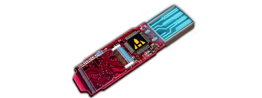

# Tactical Items Reference

Generated from `server/static-data/metagameplay.json` and `server/static-data/ids.json`.

## BustersFlamethrower

| IconImage | Tier | Id | Name | Description | SkillId | SkillIdentifier | SkillStats | SellPrice | MaxStacksize |
| --- | --- | --- | --- | --- | --- | --- | --- | --- | --- |
|  |  | Item_Consumable_BustersFlamethrower | Buster's old Flamethrower | Buster never misses a chance to invite others to a friendly barbecue. This custom made disposable flamethrower does damage to everyone in a wide cone. One time use only!  15 Damage | 60022 | Activities.ConsumablesBustersFlamethrower | DamageType=Physical; RelativeDamage=15; Range=8; AreaRadius=8 | 600 | 99 |
## Cram

| IconImage | Tier | Id | Name | Description | SkillId | SkillIdentifier | SkillStats | SellPrice | MaxStacksize |
| --- | --- | --- | --- | --- | --- | --- | --- | --- | --- |
|  |  | Item_Consumable_Cram | Cram | Cram will give you a short-term energy boost, making you faster than greased lightning. Duration: 1 turn.  [B5E61D]+ Extra Movement Range[-] [B5E61D]+1 Extra Action[-] [E51E1E]Lose 20% of your maximum Hitpoints at the start of your next turn.[-] | 60018 | Activities.ConsumablesCram | RelativeDamage=1; Range=0; StatusEffects=StatusEffects.Cram (131076) | 235 | 99 |
## EMPGrenade

| IconImage | Tier | Id | Name | Description | SkillId | SkillIdentifier | SkillStats | SellPrice | MaxStacksize |
| --- | --- | --- | --- | --- | --- | --- | --- | --- | --- |
|  |  | Item_Consumable_EMPGrenade | EMP Grenade | EMP grenades do tech damage by causing a massive electromagnetic pulse. Military surplus, so it should work most of the time.  5 Tech Damage | 60003 | Activities.ConsumablesEMPGrenade | DamageType=Technical; RelativeDamage=5; Range=9; AreaRadius=2 | 90 | 99 |
|  |  | Item_Consumable_ImprovedEMPGrenade | Impr. EMP Grenade | EMP grenades do tech damage by causing a massive electromagnetic pulse. Regular stock, so expect reliable results.  8 Tech Damage | 60013 | Activities.ConsumablesImprovedEMPGrenade | DamageType=Technical; RelativeDamage=8; Range=9; AreaRadius=2 | 170 | 99 |
|  |  | Item_Consumable_SOTAEMPGrenade | SOTA EMP Grenade | EMP grenades do tech damage by causing a massive electromagnetic pulse. These are sate of the art EMPs  doing serious damage against anything technological.  15 Tech Damage | 60014 | Activities.ConsumablesSOTAEMPGrenade | DamageType=Technical; RelativeDamage=15; Range=9; AreaRadius=2 | 600 | 99 |
|  | 2 | Item_Consumable_SOTAEMPGrenade2 | Superior EMP Grenade | EMP grenades do tech damage by causing a massive electromagnetic pulse. These are the extremely effective EMPs doing massive damage against anything technological.  20 Tech Damage | 60027 | Activities.ConsumablesSOTAEMPGrenade2 | DamageType=Technical; RelativeDamage=20; Range=9; AreaRadius=2 | 260 | 99 |
|  | 3 | Item_Consumable_SOTAEMPGrenade3 | MilSpec EMP Grenade | EMP grenades do tech damage by causing a massive electromagnetic pulse. These are the best EMPs that money can buy, obliterating anything technological.  30 Tech Damage | 60026 | Activities.ConsumablesSOTAEMPGrenade3 | DamageType=Technical; RelativeDamage=30; Range=9; AreaRadius=2 | 740 | 99 |

## FragGrenade

| IconImage | Tier | Id | Name | Description | SkillId | SkillIdentifier | SkillStats | SellPrice | MaxStacksize |
| --- | --- | --- | --- | --- | --- | --- | --- | --- | --- |
|  |  | Item_Consumable_FragGrenade | Frag Grenade | A tiny barrel of boom. Fragmentation grenades cause physical damage by sending little bits of shrapnel flying everywhere. This one comes from military surplus, end-user experience may vary.  5 Physical Damage | 60001 | Activities.ConsumablesFragGrenade | DamageType=Physical; RelativeDamage=5; Range=9; AreaRadius=2 | 90 | 99 |
|  |  | Item_Consumable_ImprovedFragGrenade | Impr. Frag Grenade | A tiny barrel of boom. Fragmentation grenades cause physical damage by sending little bits of shrapnel flying everywhere. Regular stock, so it's bound to perform more reliably and do more damage.  8 Physical Damage | 60011 | Activities.ConsumablesImprovedFragGrenade | DamageType=Physical; RelativeDamage=8; Range=9; AreaRadius=2 | 200 | 99 |
|  |  | Item_Consumable_SOTAFragGrenade | SOTA Frag Grenade | A tiny barrel of boom. Fragmentation grenades cause physical damage by sending little bits of shrapnel flying everywhere. These are the finest that money can buy, expect to be amazed.  15 Physical Damage | 60012 | Activities.ConsumablesSOTAFragGrenade | DamageType=Physical; RelativeDamage=15; Range=9; AreaRadius=2 | 600 | 99 |
## Healing Items

| IconImage | Tier | Id | Name | Description | SkillId | SkillIdentifier | SkillStats | SellPrice | MaxStacksize |
| --- | --- | --- | --- | --- | --- | --- | --- | --- | --- |
|  |  | Item_Consumable_DocWagonCardBasic | Doc Wagon Card Basic | A doc wagon contract is what you want, if you know you're going to get shot. The Basic Contract covers patching you up and sending you on your way.  Restores 15 Hitpoints for yourself or an adjacent ally. | 60015 | Activities.ConsumablesDocWagonBasic | RelativeDamage=1; Range=0; HealAmount=15 | 220 | 99 |
|  |  | Item_Consumable_DocWagonCardGold | Doc Wagon Card Gold | A doc wagon contract is what you want, if you know you're going to get shot. The Gold Contract covers patching you up and sending you on your way.  Restores 25 Hitpoints for yourself or an adjacent ally. | 60016 | Activities.ConsumablesDocWagonGold | RelativeDamage=1; Range=0; HealAmount=25 | 360 | 99 |
|  |  | Item_Consumable_DocWagonCardPlatinum | Doc Wagon Card Platinum | A doc wagon contract is what you want, if you know you're going to get shot. The Platin Contract covers patching you up and sending you on your way.  Restores 35 Hitpoints for yourself or an adjacent ally. | 60017 | Activities.ConsumablesDocWagonPlatinum | RelativeDamage=1; Range=0; HealAmount=35 | 700 | 99 |
|  |  | Item_Consumable_Medkit | Medkit | This handy kit contains quik-clot, trauma patches, painkillers and a variety of colored band-aids. Great for quickly patching up a leaky chummer.  Restores 10 Hitpoints for yourself or an adjacent ally. | 60010 | Activities.ConsumablesMedkit | RelativeDamage=1; Range=0; HealAmount=10 | 90 | 99 |
## Interactions

| IconImage | Tier | Id | Name | Description | SkillId | SkillIdentifier | SkillStats | SellPrice | MaxStacksize |
| --- | --- | --- | --- | --- | --- | --- | --- | --- | --- |
|  |  | Item_Consumable_InteractionDemolish | Remote Det | A wall is just a door with another kind of key. And C15 is definitely the all-access key. One-time use, use this to break through obstacles or open pesky lockers. One-time use only. | 60007 | Activities.ConsumablesInteractionDemolish | None parsed | 150 | 99 |
|  |  | Item_Consumable_InteractionHacking | Hacking - Autosoft | This handy piece of equipment contains a power cell and various expert programs that can break through most digital security systems. One-time use only. | 60006 | Activities.ConsumablesInteractionHacking | None parsed | 150 | 99 |
|  |  | Item_Consumable_InteractionLockpicking | Autopicker | This disposable tool is guaranteed to get into any mechanical lock, no skill required. One-time use only. | 60008 | Activities.ConsumablesInteractionLockpicking | None parsed | 150 | 99 |
|  |  | Item_Consumable_InteractionOrganHarvest | Portable Bodyscan | No matter if you flunked med school or never quite got that Hannibal Lecter thing down - a portable bodyscanner shows a chummer exactly where to cut when a bit of cyberware just cannot be left to go to waste. One-time use only. | 60009 | Activities.ConsumablesInteractionOrganHarvest | None parsed | 150 | 99 |
## Jazz

| IconImage | Tier | Id | Name | Description | SkillId | SkillIdentifier | SkillStats | SellPrice | MaxStacksize |
| --- | --- | --- | --- | --- | --- | --- | --- | --- | --- |
|  |  | Item_Consumable_Jazz | Jazz | A stimulant often used to even the odds in law enforcement. Duration: 5 turns  [B5E61D]+20% Damage[-] [B5E61D]+20% Critical Hit Chance[-] [E51E1E]-15% Accuracy[-] | 60020 | Activities.ConsumablesJazz | RelativeDamage=1; Range=0; StatusEffects=StatusEffects.Jazz (131082) | 255 | 99 |
## Kamikaze

| IconImage | Tier | Id | Name | Description | SkillId | SkillIdentifier | SkillStats | SellPrice | MaxStacksize |
| --- | --- | --- | --- | --- | --- | --- | --- | --- | --- |
|  |  | Item_Consumable_Kamikaze | Kamikaze | A dose of synthetic amphetamines that will make you fast, nasty and oblivious to danger. Duration: 2 turns  [B5E61D]+25% extra Damage[-] [B5E61D]+1 Action[-] [E51E1E]You receive 15% health damage every turn[-] | 60019 | Activities.ConsumablesKamikaze | RelativeDamage=1; Range=0; StatusEffects=StatusEffects.Berserk (131181) | 50 | 99 |
## RocketLauncher

| IconImage | Tier | Id | Name | Description | SkillId | SkillIdentifier | SkillStats | SellPrice | MaxStacksize |
| --- | --- | --- | --- | --- | --- | --- | --- | --- | --- |
|  |  | Item_Consumable_Exclusive_RocketLauncher | GamesRocket Launcher | This limited-edition explosive rascal vaporizes everything within its blast radius. | 60021 | Activities.ConsumablesExclusiveRocketLauncher | DamageType=Physical; RelativeDamage=20; Range=8; AreaRadius=5 | 150 | 99 |
|  |  | Item_Consumable_RocketLauncher | Rocket Launcher | A portable, disposable rocket launcher. Comes with optical aiming device and illustrated manual.  20 Physical Damage | 60004 | Activities.ConsumablesRocketLauncher | DamageType=Physical; RelativeDamage=20; Range=14; AreaRadius=5 | 670 | 99 |
## SmedleysMinigun

| IconImage | Tier | Id | Name | Description | SkillId | SkillIdentifier | SkillStats | SellPrice | MaxStacksize |
| --- | --- | --- | --- | --- | --- | --- | --- | --- | --- |
|  |  | Item_Consumable_SmedleysMinigun | Smedley's Vindicator | An early version of GE's high velocity bullet spewing machine of destruction, which can be used once to fire rain of bullets at a single enemy. Due to a construction error, this run of guns can only be used once, after which they malfunction. This is why they are so cheap!  5 Damage per Burst Fires 10 Bursts | 60023 | Activities.ConsumablesSmedleysMinigun | DamageType=Physical; RelativeDamage=5; Range=11; CritChanceModifier=0.05 | 600 | 99 |
## SmokeGrenade

| IconImage | Tier | Id | Name | Description | SkillId | SkillIdentifier | SkillStats | SellPrice | MaxStacksize |
| --- | --- | --- | --- | --- | --- | --- | --- | --- | --- |
|  |  | Item_Consumable_SmokeGrenade | Stun Grenade | Stun grenades cause concussions, ringing ears and temporary blindness. Do not throw at children, look away from blast for best results.  Stuns enemies in range. | 60002 | Activities.ConsumablesStunGrenade | RelativeDamage=1; Range=9; AreaRadius=2; StatusEffects=StatusEffects.Stun (131177) | 60 | 99 |
## TaserRifle

| IconImage | Tier | Id | Name | Description | SkillId | SkillIdentifier | SkillStats | SellPrice | MaxStacksize |
| --- | --- | --- | --- | --- | --- | --- | --- | --- | --- |
|  |  | Item_Consumable_TaserRifle | Yamaha Pulsar | Reliably stuns enemies at a distance! This worn down 2060s model of a taser contain wireless capacitors, meaning that the Taser eliminates the need for cumbersome wires. Unfortunately the batteries can only sustain a single shot.  10 Damage Stuns the target. | 60024 | Activities.ConsumablesTaserRifle | DamageType=Technical; RelativeDamage=10; Range=10; StatusEffects=StatusEffects.Stun (131177) | 270 | 99 |
## TheRipper

| IconImage | Tier | Id | Name | Description | SkillId | SkillIdentifier | SkillStats | SellPrice | MaxStacksize |
| --- | --- | --- | --- | --- | --- | --- | --- | --- | --- |
|  |  | Item_Consumable_TheRipper | Ash Arms Chainsaw | An early model of the popular Ash Arm cutting device, this combat chainsaw has no safety and will always deal a critical hit on an enemy in melee range. Due to its limited fuel tank, it is single use only unfortunately.  20 Damage Always hits critical. | 60025 | Activities.ConsumablesTheRipper | DamageType=Physical; RelativeDamage=20; Range=1; CritChanceModifier=1 | 600 | 99 |
