# Weapons Reference

Generated from `server/static-data/metagameplay.json`, `server/static-data/weapons.json`, and `server/static-data/ids.json`.

## Automatics

| IconImage | Tier | Name | Id | Ammo | MaximumChanceToHit | CriticalChance | DamageMinimum | DamageMaxmimum | Range | CriticalDamageMultiplier | PointBlankRange |
| --- | --- | --- | --- | --- | --- | --- | --- | --- | --- | --- | --- |
|  | 0 | Used Ingram Smartgun | Automatics_IngramSmartgun_Tier_00 | 5 | 0.8 | 0.05 | 3 | 4 | 10 | 1.2 | 3 |
|  | 1 | Ingram Smartgun | Automatics_IngramSmartgun_Tier_01 | 5 | 0.8 | 0.05 | 5 | 6 | 10 | 1.2 | 3 |
|  | 1 | Ingram Smartgun SL | Automatics_Exclusive_IngramSmartgunSL_Tier_01 | 5 | 0.85 | 0.05 | 5 | 6 | 11 | 1.2 | 3 |
|  | 1 | Prototype MAG-5 | Automatics_Exclusive_Mag5Mg_Tier_01 | 5 | 0.8 | 0.05 | 3 | 5 | 10 | 1.3 | 3 |
|  | 1 | Used FN-P93 Praetor | Automatics_FnP93Praetor_Tier_01 | 5 | 0.8 | 0.15 | 4 | 6 | 10 | 1.2 | 3 |
| 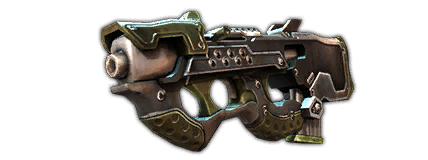 | 2 | FN-P93 Praetor | Automatics_FnP93Praetor_Tier_02 | 5 | 0.8 | 0.15 | 5 | 8 | 10 | 1.2 | 3 |
| 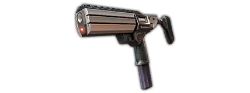 | 2 | Ingram Smartgun X | Automatics_IngramSmartgun_Tier_02 | 5 | 0.8 | 0.05 | 6 | 8 | 10 | 1.2 | 3 |
|  | 3 | Ingram Smartgun XA | Automatics_IngramSmartgun_Tier_03 | 5 | 0.7 | 0.05 | 7 | 14 | 9 | 1.3 | 3 |
|  | 3 | Used FN-P93 Praetor EF | Automatics_FnP93Praetor_Tier_03 | 5 | 0.85 | 0.05 | 9 | 11 | 11 | 1.2 | 3 |
| 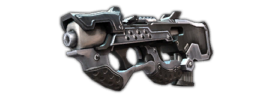 | 4 | FN-P93 Praetor EF | Automatics_FnP93Praetor_Tier_04 | 5 | 0.85 | 0.05 | 9 | 12 | 11 | 1.2 | 3 |
| 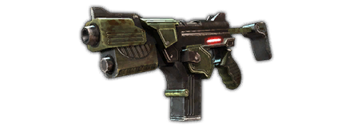 | 4 | Used Ares Executive Protector | Automatics_AresExecutiveProtector_Tier_04 | 5 | 0.7 | 0.05 | 8 | 15 | 9 | 1.3 | 3 |
| 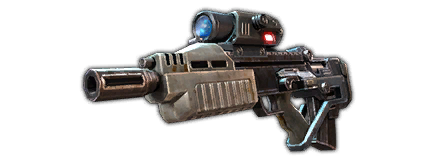 | 4 | Used HK-G38 | Automatics_HkG38_Tier_04 | 5 | 0.8 | 0.07 | 10 | 13 | 8 | 1.25 | 3 |
| 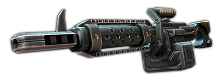 | 4 | Used Mag-5 MG | Automatics_Mag5Mg_Tier_04 | 5 | 0.8 | 0.05 | 9 | 13 | 10 | 1.3 | 3 |
| 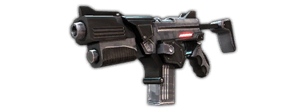 | 5 | Ares Executive Protector IV | Automatics_AresExecutiveProtector_Tier_05 | 5 | 0.7 | 0.05 | 10 | 19 | 9 | 1.3 | 3 |
| 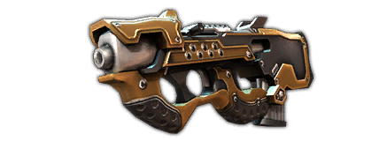 | 5 | FN-P93 Praetor II | Automatics_FnP93Praetor_Tier_05 | 5 | 0.85 | 0.05 | 12 | 15 | 11 | 1.2 | 3 |
| 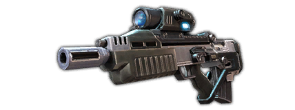 | 5 | HK-G38 | Automatics_HkG38_Tier_05 | 5 | 0.8 | 0.07 | 12 | 16 | 8 | 1.25 | 3 |
| 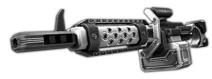 | 5 | Mag-5 MG | Automatics_Mag5Mg_Tier_05 | 5 | 0.8 | 0.05 | 12 | 17 | 10 | 1.3 | 3 |
| 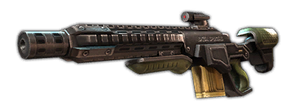 | 5 | Skua DMR | Automatics_SkuaDmr_Tier_05 | 3 | 0.8 | 0.3 | 16 | 22 | 13 | 1.2 | 3 |
|  | 5 | Used Skua DMR | Automatics_SkuaDmr_Coupon_Tier_05 | 3 | 0.8 | 0.3 | 8 | 11 | 13 | 1.2 | 3 |
| 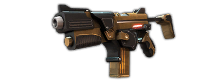 | 7 | Ares Executive Protector V | Automatics_AresExecutiveProtector_Tier_07 | 5 | 0.7 | 0.05 | 13 | 25 | 9 | 1.3 | 3 |
| 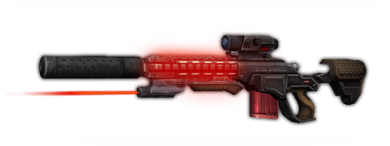 | 7 | Modded Skua | Automatics_ModSkua_Tier_07 | 5 | 0.95 | 0.05 | 18 | 22 | 11 | 1.2 | 4 |
| 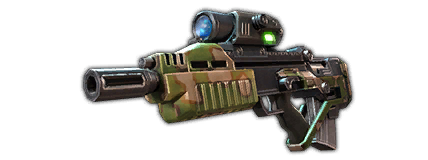 | 7 | Modified HK-G38 | Automatics_HkG38_Tier_07 | 5 | 0.8 | 0.07 | 16 | 21 | 8 | 1.25 | 3 |
| 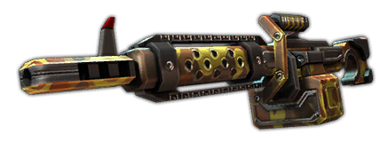 | 7 | Modified Mag-5 MG | Automatics_Mag5Mg_Tier_07 | 5 | 0.8 | 0.05 | 15 | 22 | 10 | 1.3 | 3 |
| 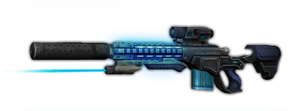 | 7 | Rare Modded Skua | Automatics_ModSkua_Blue_Tier_07 | 5 | 0.8 | 0.05 | 20 | 26 | 10 | 1.35 | 3 |
| 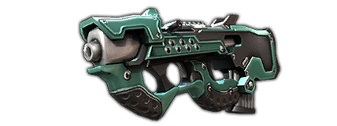 | 8 | Custom FN-P93 Praetor  | Automatics_FnP93Praetor_Tier_08 | 5 | 0.85 | 0.05 | 15 | 20 | 11 | 1.2 | 3 |
| 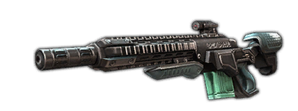 | 8 | Skua DMR MK 2 | Automatics_SkuaDmr_Tier_08 | 3 | 0.8 | 0.3 | 19 | 25 | 13 | 1.2 | 3 |
| 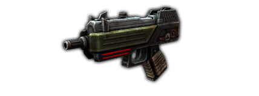 | 8 | Used Ingram Warrior  | Automatics_IngramSmartgun_Tier_08 | 5 | 0.65 | 0.05 | 14 | 26 | 9 | 1.3 | 3 |
| 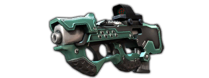 | 9 | Custom FN-P93 Praetor II | Automatics_FnP93Praetor_Tier_09 | 5 | 0.85 | 0.05 | 18 | 22 | 11 | 1.2 | 3 |
| 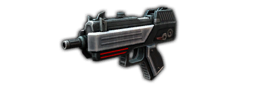 | 9 | Ingram Warrior | Automatics_IngramSmartgun_Tier_09 | 5 | 0.7 | 0.05 | 15 | 29 | 9 | 1.3 | 3 |
| 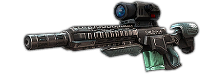 | 9 | Skua DMR MK 2 Pro | Automatics_SkuaDmr_Tier_09 | 3 | 0.8 | 0.3 | 21 | 29 | 13 | 1.2 | 3 |
| 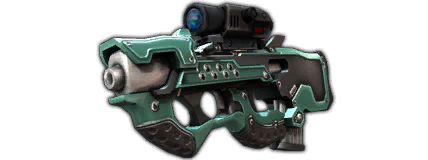 | 10 | Improved FN-P93 Praetor III | Automatics_FnP93Praetor_Tier_10 | 5 | 0.85 | 0.05 | 19 | 23 | 11 | 1.2 | 3 |
| 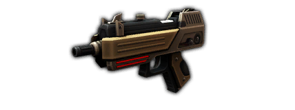 | 10 | Ingram Warrior X | Automatics_IngramSmartgun_Tier_10 | 5 | 0.7 | 0.05 | 16 | 30 | 9 | 1.3 | 3 |
| 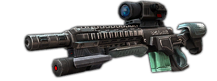 | 10 | Skua DMR MK 2 Elite | Automatics_SkuaDmr_Tier_10 | 3 | 0.8 | 0.3 | 22 | 30 | 13 | 1.2 | 3 |

## Blade

| IconImage | Tier | Name | Id | MaximumChanceToHit | CriticalChance | DamageMinimum | DamageMaxmimum | Range | CriticalDamageMultiplier |
| --- | --- | --- | --- | --- | --- | --- | --- | --- | --- |
|  | 0 | Rusty Cleaver | Blade_Cleaver_Tier_00 | 0.95 | 0.15 | 4 | 5 | 1 | 1.2 |
| 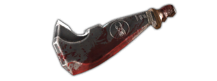 | 1 | Cleaver | Blade_Cleaver_Tier_01 | 0.95 | 0.15 | 5 | 7 | 1 | 1.2 |
| 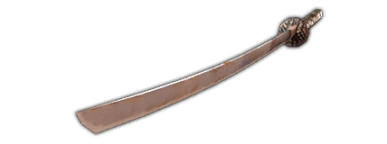 | 1 | Rusty Katana | Blade_Katana_Tier_01 | 0.95 | 0.25 | 5 | 6 | 1 | 1.2 |
|  | 1 | Sledge's Sword | Blade_Exclusive_SledgeSword_Tier_01 | 0.95 | 0.15 | 8 | 11 | 1 | 1.3 |
| 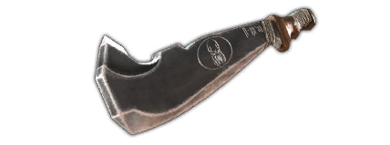 | 2 | Custom Cleaver | Blade_Cleaver_Tier_02 | 0.95 | 0.15 | 7 | 10 | 1 | 1.2 |
|  | 2 | Katana | Blade_Katana_Tier_02 | 0.95 | 0.35 | 7 | 9 | 1 | 1.35 |
| 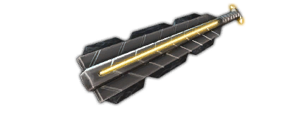 | 2 | Used Macuahuitl | Blade_Macuahuitl_Tier_02 | 0.95 | 0.25 | 9 | 11 | 1 | 1.2 |
| 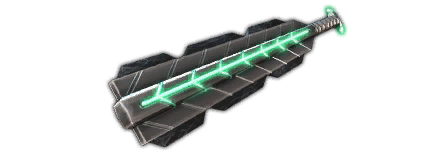 | 3 | Used Custom Macuahuitl | Blade_Macuahuitl_Tier_03 | 0.95 | 0.25 | 11 | 13 | 1 | 1.2 |
| 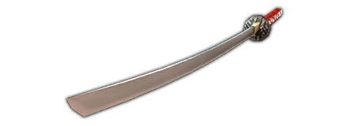 | 3 | Used Quality Katana | Blade_Katana_Tier_03 | 0.95 | 0.25 | 8 | 11 | 1 | 1.2 |
|  | 4 | Macuahuitl | Blade_Macuahuitl_Tier_04 | 0.95 | 0.25 | 12 | 15 | 1 | 1.2 |
|  | 4 | Quality Katana | Blade_Katana_Tier_04 | 0.95 | 0.25 | 9 | 12 | 1 | 1.2 |
| 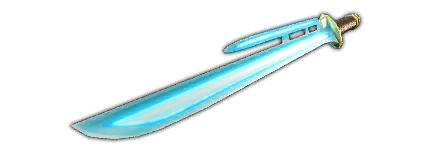 | 4 | Used Vibro-Blade | Blade_VibroBlade_Tier_04 | 0.95 | 0.05 | 13 | 17 | 1 | 1.1 |
| 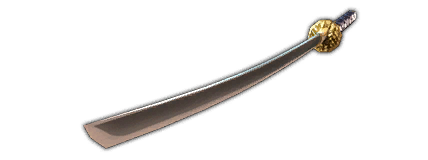 | 5 | Custom Katana | Blade_Katana_Tier_05 | 0.95 | 0.25 | 11 | 15 | 1 | 1.2 |
| 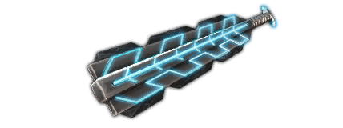 | 5 | Custom Macuahuitl | Blade_Macuahuitl_Tier_05 | 0.95 | 0.25 | 15 | 18 | 1 | 1.2 |
| 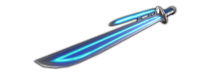 | 5 | Vibro-Blade | Blade_VibroBlade_Tier_05 | 0.95 | 0.05 | 16 | 22 | 1 | 1.1 |
|  | 7 | Custom Vibro-Blade | Blade_VibroBlade_Tier_07 | 0.95 | 0.05 | 21 | 28 | 1 | 1.1 |
| 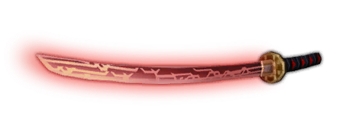 | 7 | Laser Katana | Blade_Laser_Katana_Tier_07 | 0.95 | 0.25 | 21 | 28 | 1 | 1.2 |
| 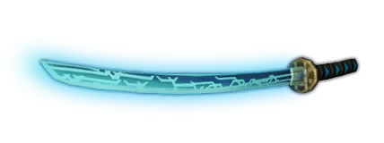 | 7 | Modded Laser Katana | Blade_Laser_Katana_Blue_Tier_07 | 0.95 | 0.15 | 23 | 29 | 1 | 1.35 |
| 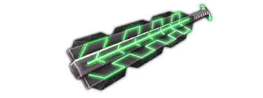 | 8 | Aztechnology Macuahuitl  | Blade_Macuahuitl_Tier_08 | 0.95 | 0.25 | 18 | 26 | 1 | 1.2 |
| 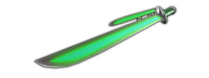 | 8 | Cutter Vibroblade  | Blade_VibroBlade_Tier_08 | 0.95 | 0.05 | 23 | 31 | 1 | 1.1 |
| 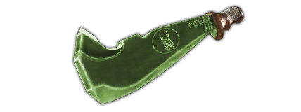 | 8 | Heavy Cleaver | Blade_Cleaver_Tier_08 | 0.95 | 0.15 | 21 | 28 | 1 | 1.25 |
| 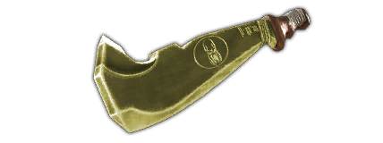 | 9 | Butcher's Cleaver  | Blade_Cleaver_Tier_09 | 0.95 | 0.15 | 22 | 29 | 1 | 1.25 |
| 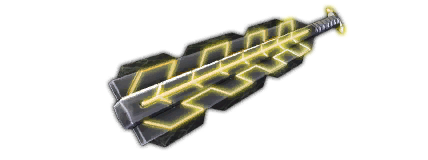 | 9 | Jaguar Guard Macuahuitl  | Blade_Macuahuitl_Tier_09 | 0.95 | 0.25 | 23 | 28 | 1 | 1.2 |
| 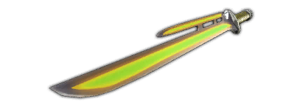 | 9 | Slayer Vibroblade  | Blade_VibroBlade_Tier_09 | 0.95 | 0.05 | 24 | 33 | 1 | 1.1 |
| 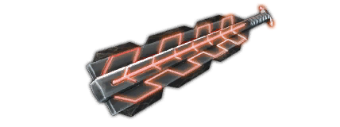 | 10 | Elite Jaguar Macuahuitl | Blade_Macuahuitl_Tier_10 | 0.95 | 0.25 | 24 | 29 | 1 | 1.2 |
| 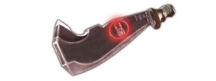 | 10 | Enchanted Cleaver  | Blade_Cleaver_Tier_10 | 0.95 | 0.15 | 23 | 30 | 1 | 1.25 |
| 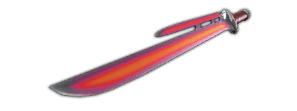 | 10 | Vorpal Vibroblade  | Blade_VibroBlade_Tier_10 | 0.95 | 0.05 | 25 | 34 | 1 | 1.1 |

## Club

| IconImage | Tier | Name | Id | MaximumChanceToHit | CriticalChance | DamageMinimum | DamageMaxmimum | Range | CriticalDamageMultiplier |
| --- | --- | --- | --- | --- | --- | --- | --- | --- | --- |
| 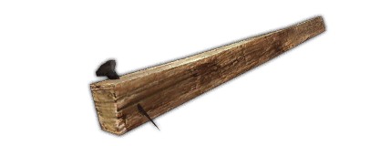 | 0 | Old Nailboard | Club_NailBoard_Tier_00 | 0.95 | 0.05 | 4 | 5 | 1 | 1.3 |
|  | 1 | Nailboard | Club_NailBoard_Tier_01 | 0.95 | 0.05 | 6 | 8 | 1 | 1.3 |
| 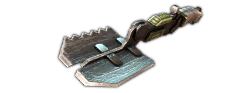 | 1 | Used Folding Spade | Club_FoldingSpade_Tier_01 | 0.95 | 0.15 | 6 | 7 | 1 | 1.3 |
|  | 2 | Folding Spade | Club_FoldingSpade_Tier_02 | 0.95 | 0.15 | 7 | 9 | 1 | 1.3 |
| 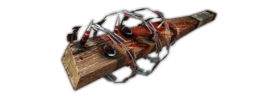 | 2 | Spiked Club | Club_NailBoard_Tier_02 | 0.95 | 0.05 | 8 | 10 | 1 | 1.3 |
| 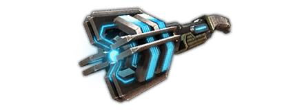 | 2 | Used Shock Mace | Club_ShockMace_Tier_02 | 0.95 | 0.05 | 9 | 12 | 1 | 1.4 |
|  | 3 | Used Combat Spade | Club_FoldingSpade_Tier_03 | 0.95 | 0.15 | 9 | 12 | 1 | 1.3 |
|  | 3 | Used Custom Shock Mace | Club_ShockMace_Tier_03 | 0.95 | 0.05 | 12 | 15 | 1 | 1.4 |
|  | 4 | Combat Spade | Club_FoldingSpade_Tier_04 | 0.95 | 0.15 | 10 | 13 | 1 | 1.3 |
|  | 4 | Shock Mace | Club_ShockMace_Tier_04 | 0.95 | 0.05 | 13 | 16 | 1 | 1.4 |
|  | 4 | Used Tonfa | Club_Tonfa_Tier_04 | 0.95 | 0.15 | 14 | 16 | 1 | 1.3 |
|  | 5 | Custom Combat Spade | Club_FoldingSpade_Tier_05 | 0.95 | 0.15 | 13 | 16 | 1 | 1.3 |
|  | 5 | Custom Shock Mace | Club_ShockMace_Tier_05 | 0.95 | 0.05 | 16 | 21 | 1 | 1.4 |
|  | 5 | Tonfa | Club_Tonfa_Tier_05 | 0.95 | 0.15 | 18 | 20 | 1 | 1.3 |
|  | 7 | Custom Tonfa | Club_Tonfa_Tier_07 | 0.95 | 0.15 | 23 | 26 | 1 | 1.3 |
|  | 7 | Modded Sledgehammer | Club_Sledgehammer_Blue_Tier_07 | 0.95 | 0.05 | 27 | 32 | 1 | 1.45 |
|  | 7 | Sledgehammer | Club_Sledgehammer_Tier_07 | 0.95 | 0.15 | 24 | 30 | 1 | 1.3 |
|  | 8 | HV Shock Mace | Club_ShockMace_Tier_08 | 0.95 | -0.05 | 26 | 34 | 1 | 1.2 |
|  | 8 | Reinforced Tonfa  | Club_Tonfa_Tier_08 | 0.95 | 0.15 | 21 | 29 | 1 | 1.3 |
|  | 8 | Warhammer 40k  | Club_NailBoard_Tier_08 | 0.95 | 0.25 | 20 | 23 | 1 | 1.45 |
|  | 9 | Elite HV Shock Mace  | Club_ShockMace_Tier_09 | 0.95 | -0.05 | 28 | 35 | 1 | 1.2 |
|  | 9 | Elite Warhammer 40k  | Club_NailBoard_Tier_09 | 0.95 | 0.25 | 21 | 25 | 1 | 1.45 |
|  | 9 | Warrior Tonfa | Club_Tonfa_Tier_09 | 0.95 | 0.15 | 27 | 30 | 1 | 1.3 |
|  | 10 | Enchanted Tonfa  | Club_Tonfa_Tier_10 | 0.95 | 0.15 | 28 | 31 | 1 | 1.3 |
|  | 10 | Enchanted Warhammer 40k  | Club_NailBoard_Tier_10 | 0.95 | 0.25 | 22 | 26 | 1 | 1.45 |
|  | 10 | MilSpec Shock Mace | Club_ShockMace_Tier_10 | 0.95 | -0.05 | 29 | 37 | 1 | 1.2 |

## Conjuring

| IconImage | Tier | Name | Id | MaximumChanceToHit | CriticalChance | DamageMinimum | DamageMaxmimum | Range | CriticalDamageMultiplier | SummonPowerMagic | PointBlankRange |
| --- | --- | --- | --- | --- | --- | --- | --- | --- | --- | --- | --- |
|  | 0 | Lesser Summoning Focus | Conjuring_ConjuringFocus_Tier_00 | 0.8 | 0.05 | 3 | 4 | 9 | 1.3 | 1 | 3 |
|  | 1 | Lesser Casting Focus | Conjuring_CombatFocus_Tier_01 | 0.95 | 0.1 | 5 | 6 | 12 | 1.3 | 1 | 3 |
|  | 1 | Summoning Focus | Conjuring_ConjuringFocus_Tier_01 | 0.8 | 0.05 | 4 | 5 | 9 | 1.3 | 2 | 3 |
|  | 2 | Strong Summoning Focus | Conjuring_ConjuringFocus_Tier_02 | 0.8 | 0.05 | 6 | 7 | 9 | 1.3 | 4 | 3 |
|  | 3 | Casting Focus | Conjuring_CombatFocus_Tier_03 | 0.95 | 0.1 | 8 | 11 | 12 | 1.3 | 4 | 3 |
|  | 3 | Major Summoning Focus | Conjuring_ConjuringFocus_Tier_03 | 0.8 | 0.05 | 7 | 9 | 9 | 1.3 | 5 | 3 |
|  | 4 | Greater Casting Focus | Conjuring_CombatFocus_Tier_04 | 0.95 | 0.1 | 9 | 12 | 12 | 1.3 | 5 | 3 |
|  | 4 | Imbued Summoning Focus | Conjuring_ConjuringFocus_Tier_04 | 0.8 | 0.05 | 8 | 10 | 9 | 1.3 | 6 | 3 |
|  | 5 | Superior Casting Focus | Conjuring_CombatFocus_Tier_05 | 0.95 | 0.1 | 11 | 15 | 12 | 1.3 | 6 | 3 |
|  | 5 | Superior Summoning Focus | Conjuring_ConjuringFocus_Tier_05 | 0.8 | 0.05 | 10 | 13 | 9 | 1.3 | 7 | 3 |
|  | 6 | Powerful Casting Focus | Conjuring_CombatFocus_Tier_06 | 0.95 | 0.1 | 13 | 17 | 12 | 1.3 | 8 | 3 |
|  | 6 | Powerful Summoning Focus | Conjuring_ConjuringFocus_Tier_06 | 0.8 | 0.05 | 12 | 14 | 9 | 1.3 | 9 | 3 |
|  | 7 | Exceptional Summoning Focus | Conjuring_Summoning_Focus_Tier_07 | 0.95 | 0.05 | 17 | 19 | 10 | 1.3 | 11 | 4 |
|  | 7 | Mod. Exceptional Summoning Focus | Conjuring_Summoning_Focus_Blue_Tier_07 | 0.8 | 0.05 | 16 | 19 | 10 | 1.3 | 14 | 3 |
|  | 8 | Initiate's Casting Focus | Conjuring_CombatFocus_Tier_08 | 0.95 | 0.1 | 16 | 22 | 12 | 1.3 | 9 | 3 |
|  | 8 | Initiate's Summoning Focus | Conjuring_ConjuringFocus_Tier_08 | 0.8 | 0.05 | 13 | 16 | 9 | 1.3 | 12 | 3 |
|  | 9 | Master's Casting Focus | Conjuring_CombatFocus_Tier_09 | 0.95 | 0.1 | 17 | 23 | 12 | 1.3 | 11 | 3 |
|  | 9 | Master's Summoning Focus | Conjuring_ConjuringFocus_Tier_09 | 0.8 | 0.05 | 13 | 17 | 9 | 1.3 | 14 | 3 |
|  | 10 | Ancient Casting Focus | Conjuring_CombatFocus_Tier_10 | 0.95 | 0.1 | 18 | 24 | 12 | 1.3 | 12 | 3 |
|  | 10 | Ancient Summoning Focus | Conjuring_ConjuringFocus_Tier_10 | 0.8 | 0.05 | 14 | 18 | 9 | 1.3 | 15 | 3 |

## Hacking

| IconImage | Tier | Name | Id | MaximumChanceToHit | CriticalChance | DamageMinimum | DamageMaxmimum | Range | CriticalDamageMultiplier |
| --- | --- | --- | --- | --- | --- | --- | --- | --- | --- |
|  | 0 | Used Erika MCD-1 | Hacking_Mcd1Deck_Tier_00 | 0.8 | 0.05 | 3 | 4 | 11 | 1.3 |
|  | 1 | Erika MCD-1 | Hacking_Mcd1Deck_Tier_01 | 0.8 | 0.05 | 4 | 5 | 11 | 1.3 |
|  | 1 | Used Microtrónica Azteca 200 | Hacking_Aztecha200_Tier_01 | 0.85 | 0.05 | 4 | 5 | 12 | 1.3 |
|  | 2 | Custom Erika MCD-1 | Hacking_Mcd1Deck_Tier_02 | 0.8 | 0.05 | 5 | 7 | 11 | 1.3 |
|  | 3 | Hermes Chariot | Hacking_Mcd1Deck_Tier_03 | 0.8 | 0.05 | 6 | 9 | 11 | 1.3 |
|  | 3 | Microtrónica Azteca 200 | Hacking_Aztecha200_Tier_03 | 0.8 | 0.05 | 7 | 10 | 14 | 1.3 |
|  | 3 | Used Novatech Navigator | Hacking_MicrodeckSummit_Tier_03 | 0.8 | 0.15 | 6 | 9 | 12 | 1.45 |
|  | 4 | Hermes Chariot IX | Hacking_Mcd1Deck_Tier_04 | 0.8 | 0.05 | 7 | 10 | 11 | 1.3 |
|  | 4 | Novatech Navigator | Hacking_MicrodeckSummit_Tier_04 | 0.8 | 0.15 | 7 | 10 | 12 | 1.45 |
|  | 4 | Used Microtrónica Azteca 200S | Hacking_Aztecha200_Tier_04 | 0.8 | 0.05 | 7 | 11 | 14 | 1.3 |
|  | 5 | Hermes Chariot X | Hacking_Mcd1Deck_Tier_05 | 0.8 | 0.05 | 9 | 13 | 11 | 1.3 |
|  | 5 | Microtrónica Azteca 200S | Hacking_Aztecha200_Tier_05 | 0.8 | 0.05 | 9 | 14 | 14 | 1.3 |
|  | 5 | Upgraded Novatech Navigator | Hacking_MicrodeckSummit_Tier_05 | 0.8 | 0.15 | 8 | 13 | 12 | 1.45 |
|  | 6 | Custom Hermes Chariot | Hacking_Mcd1Deck_Tier_06 | 0.8 | 0.05 | 10 | 14 | 11 | 1.3 |
|  | 6 | Custom Microtrónica Azteca 200 | Hacking_Aztecha200_Tier_06 | 0.8 | 0.05 | 11 | 16 | 14 | 1.3 |
|  | 6 | Custom Novatech Navigator | Hacking_MicrodeckSummit_Tier_06 | 0.8 | 0.15 | 10 | 15 | 12 | 1.45 |
|  | 7 | Modded Renraku Tsurugi | Hacking_Renraku_Tsurugi_Blue_Tier_07 | 0.95 | 0.05 | 15 | 19 | 11 | 1.3 |
|  | 7 | Renraku Tsurugi | Hacking_Renraku_Tsurugi_Tier_07 | 0.8 | 0.25 | 13 | 18 | 12 | 1.3 |
|  | 8 | Renraku Tsurugi Elite  | Hacking_Aztecha200_Tier_08 | 0.8 | 0.05 | 13 | 19 | 14 | 1.3 |
|  | 8 | Sony CIY- 720  | Hacking_MicrodeckSummit_Tier_08 | 0.8 | 0.17 | 12 | 20 | 11 | 1.4 |
|  | 9 | Custom Renraku Tsurugi  | Hacking_Aztecha200_Tier_09 | 0.8 | 0.05 | 14 | 21 | 14 | 1.3 |
|  | 9 | Shiawase Cyber-5  | Hacking_MicrodeckSummit_Tier_09 | 0.8 | 0.17 | 13 | 21 | 11 | 1.45 |
|  | 10 | Fairlight Excalibur  | Hacking_Aztecha200_Tier_10 | 0.8 | 0.05 | 15 | 23 | 15 | 1.3 |
|  | 10 | Jane's Shiawase Cyber-5  | Hacking_MicrodeckSummit_Tier_10 | 0.8 | 0.17 | 14 | 22 | 11 | 1.45 |

## Item

| IconImage | Tier | Name | Id | MaximumChanceToHit | CriticalChance | DamageMinimum | DamageMaxmimum | Range | CriticalDamageMultiplier | PointBlankRange |
| --- | --- | --- | --- | --- | --- | --- | --- | --- | --- | --- |
|  |  | Taser Rifle | Item_TutorialStunGun | 0.8 | -1 | 5 | 5 | 7 | 1.5 | 3 |
|  |  | Tonfa | Item_MeleeWeapon | 1 | -1 | 10 | 10 | 1 | 1.5 | 0 |

## Pistol

| IconImage | Tier | Name | Id | Ammo | MaximumChanceToHit | CriticalChance | DamageMinimum | DamageMaxmimum | Range | CriticalDamageMultiplier | PointBlankRange |
| --- | --- | --- | --- | --- | --- | --- | --- | --- | --- | --- | --- |
|  | 0 | Ares Lightfire 60 | Pistol_AresLightfire_Tier_00 | 4 | 0.75 | 0.15 | 3 | 3 | 8 | 1.2 | 2 |
|  | 1 | Ares Lightfire 70 | Pistol_AresLightfire_Tier_01 | 4 | 0.75 | 0.15 | 4 | 5 | 8 | 1.2 | 2 |
|  | 1 | Haemmerli 620 ST | Pistol_Exclusive_Haemmerli620s_Tier_01 | 4 | 0.75 | 0.15 | 3 | 4 | 8 | 1.3 | 2 |
|  | 1 | Used Ares Predator | Pistol_AresPredator_Tier_01 | 4 | 0.8 | 0.15 | 5 | 5 | 9 | 1.2 | 2 |
|  | 2 | Ares Lightfire 70S | Pistol_AresLightfire_Tier_02 | 4 | 0.75 | 0.15 | 6 | 7 | 8 | 1.2 | 2 |
|  | 2 | Used Ruger Super Warhawk | Pistol_SuperWarhawk_Tier_02 | 4 | 0.75 | 0.15 | 6 | 8 | 8 | 1.3 | 2 |
|  | 3 | Ares Predator IV | Pistol_AresPredator_Tier_03 | 4 | 0.75 | 0.15 | 8 | 9 | 11 | 1.2 | 2 |
|  | 3 | Modified Ares Lightfire 70 | Pistol_AresLightfire_Tier_03 | 4 | 0.75 | 0.25 | 7 | 9 | 9 | 1.35 | 2 |
|  | 3 | Ruger Super Warhawk | Pistol_SuperWarhawk_Tier_03 | 4 | 0.75 | 0.15 | 8 | 10 | 8 | 1.3 | 2 |
|  | 4 | Haemmerli 620s V | Pistol_Haemmerli620s_Tier_04 | 4 | 0.75 | 0.25 | 7 | 10 | 9 | 1.35 | 2 |
|  | 4 | SK Spraydown V | Pistol_SkSpraydown_Tier_04 | 4 | 0.75 | 0.15 | 8 | 10 | 11 | 1.2 | 2 |
|  | 4 | Used SK Spraydown | Pistol_SkSpraydown_Coupon_Tier_04 | 4 | 0.75 | 0.15 | 6 | 8 | 8 | 1.3 | 2 |
|  | 5 | Ares Predator V | Pistol_AresPredator_Tier_05 | 4 | 0.75 | 0.15 | 11 | 13 | 11 | 1.2 | 2 |
|  | 5 | Ruger Super Warhawk RC | Pistol_SuperWarhawk_Tier_05 | 4 | 0.75 | 0.15 | 11 | 14 | 8 | 1.3 | 2 |
|  | 5 | Used Cavalier Deputy | Pistol_CavalierDeputy_Tier_05 | 4 | 0.75 | 0.25 | 10 | 12 | 9 | 1.35 | 2 |
|  | 6 | Cavalier Deputy | Pistol_CavalierDeputy_Tier_06 | 4 | 0.75 | 0.25 | 11 | 14 | 9 | 1.35 | 2 |
|  | 6 | Custom Ares Predator V | Pistol_AresPredator_Tier_06 | 4 | 0.75 | 0.15 | 12 | 15 | 11 | 1.2 | 2 |
|  | 6 | Custom Ruger Super Warhawk | Pistol_SuperWarhawk_Tier_06 | 4 | 0.75 | 0.15 | 13 | 16 | 8 | 1.3 | 2 |
|  | 7 | Custom Cavalier Deputy | Pistol_CavalierDeputy_Tier_07 | 4 | 0.75 | 0.27 | 12 | 17 | 8 | 1.3 | 2 |
|  | 7 | Modded Haemmerli | Pistol_Mod_Haemmerli_Tier_07 | 4 | 0.9 | 0.15 | 17 | 18 | 9 | 1.2 | 3 |
|  | 7 | Rare Modded Haemmerli | Pistol_Mod_Haemmerli_Blue_Tier_07 | 4 | 0.75 | 0.15 | 19 | 21 | 8 | 1.35 | 2 |
|  | 8 | Ares Predator V Steel  | Pistol_AresPredator_Tier_08 | 4 | 0.75 | 0.15 | 14 | 18 | 11 | 1.2 | 2 |
|  | 8 | Ruger Super Warhawk SM  | Pistol_SuperWarhawk_Tier_08 | 4 | 0.75 | 0.15 | 17 | 20 | 8 | 1.25 | 2 |
|  | 8 | Used Armtech MGL-6  | Pistol_AresLightfire_Tier_08 | 4 | 0.75 | 0.27 | 14 | 19 | 8 | 1.3 | 2 |
|  | 9 | Ares Predator V Gold  | Pistol_AresPredator_Tier_09 | 4 | 0.75 | 0.15 | 16 | 20 | 11 | 1.2 | 2 |
|  | 9 | New Armtech MGL-6  | Pistol_AresLightfire_Tier_09 | 4 | 0.75 | 0.27 | 14 | 20 | 8 | 1.3 | 2 |
|  | 9 | Ruger Super Warhawk SM+ | Pistol_SuperWarhawk_Tier_09 | 4 | 0.75 | 0.15 | 18 | 21 | 8 | 1.25 | 2 |
|  | 10 | Ares Predator V Platinum  | Pistol_AresPredator_Tier_10 | 4 | 0.75 | 0.15 | 18 | 22 | 12 | 1.2 | 2 |
|  | 10 | Custom Armtech MGL-6  | Pistol_AresLightfire_Tier_10 | 4 | 0.75 | 0.27 | 16 | 21 | 8 | 1.35 | 2 |
|  | 10 | Ruger Super Warhawk SME | Pistol_SuperWarhawk_Tier_10 | 4 | 0.75 | 0.15 | 18 | 22 | 8 | 1.25 | 2 |

## Rigging

| IconImage | Tier | Name | Id | MaximumChanceToHit | CriticalChance | DamageMinimum | DamageMaxmimum | Range | CriticalDamageMultiplier | SummonPowerCombatSoft | SummonPowerECMSoft |
| --- | --- | --- | --- | --- | --- | --- | --- | --- | --- | --- | --- |
|  | 0 | Used Radio Shack Remote | Rigging_ControlRigInterface_Tier_00 | 0.9 | 0.05 | 2 | 3 | 11 | 1.3 | 3 | -1 |
|  | 1 | Radio Shack Remote | Rigging_ControlRigInterface_Tier_01 | 0.9 | 0.05 | 4 | 5 | 11 | 1.3 | 4 | -1 |
|  | 1 | Used Essy Motors DroneMaster | Rigging_ModdedRigInterface_Tier_01 | 0.9 | 0.05 | 5 | 6 | 12 | 1.3 | 1 | 5 |
|  | 2 | Radio Shack Remote 200 | Rigging_ControlRigInterface_Tier_02 | 0.9 | 0.05 | 5 | 6 | 11 | 1.3 | 6 | 0 |
|  | 3 | Essy Motors DroneMaster | Rigging_ModdedRigInterface_Tier_03 | 0.9 | 0.05 | 6 | 7 | 12 | 1.3 | 2 | 6 |
|  | 3 | Used Maersk Spider | Rigging_ControlRigInterface_Tier_03 | 0.9 | 0.05 | 5 | 7 | 11 | 1.3 | 4 | 4 |
|  | 4 | Damaged Vulcan Liegelord | Rigging_ModdedRigInterface_Tier_04 | 0.9 | 0.05 | 7 | 8 | 12 | 1.3 | 3 | 7 |
|  | 4 | Maersk Spider | Rigging_ControlRigInterface_Tier_04 | 0.9 | 0.05 | 6 | 8 | 11 | 1.3 | 5 | 5 |
|  | 5 | Upgraded Maersk Spider | Rigging_ControlRigInterface_Tier_05 | 0.9 | 0.05 | 8 | 11 | 11 | 1.3 | 9 | 3 |
|  | 5 | Used Vulcan Liegelord | Rigging_ModdedRigInterface_Tier_05 | 0.9 | 0.05 | 8 | 10 | 12 | 1.3 | 4 | 8 |
|  | 6 | Maersk Spider 600 | Rigging_ControlRigInterface_Tier_06 | 0.9 | 0.05 | 9 | 11 | 11 | 1.3 | 8 | 8 |
|  | 6 | Vulcan Liegelord | Rigging_ModdedRigInterface_Tier_06 | 0.9 | 0.05 | 10 | 11 | 12 | 1.3 | 6 | 10 |
|  | 7 | MCT Drone Web | Rigging_MCT_Drone_Web_Tier_07 | 1 | 0.05 | 11 | 14 | 12 | 1.3 | 12 | 11 |
|  | 7 | Modded MCT Drone Web | Rigging_MCT_Drone_Web_Blue_Tier_07 | 0.9 | 0.05 | 11 | 15 | 12 | 1.3 | 14 | 9 |
|  | 8 | Compuforce TaskMaster  | Rigging_ControlRigInterface_Tier_08 | 0.9 | 0.05 | 12 | 14 | 13 | 1.3 | 9 | 14 |
|  | 8 | Modded Vulcan Liegelord  | Rigging_ModdedRigInterface_Tier_08 | 0.9 | 0.05 | 12 | 14 | 12 | 1.3 | 8 | 13 |
|  | 9 | Bozeman's Compuforce TaskMaster  | Rigging_ControlRigInterface_Tier_09 | 0.9 | 0.05 | 13 | 18 | 13 | 1.3 | 16 | 9 |
|  | 9 | Bri's Vulcan Liegelord  | Rigging_ModdedRigInterface_Tier_09 | 0.9 | 0.05 | 13 | 15 | 13 | 1.3 | 11 | 14 |
|  | 10 | Lone Star Remote Commander  | Rigging_ModdedRigInterface_Tier_10 | 0.9 | 0.05 | 13 | 15 | 13 | 1.3 | 12 | 16 |
|  | 10 | Proteus Poseidon  | Rigging_ControlRigInterface_Tier_10 | 0.9 | 0.05 | 13 | 18 | 13 | 1.3 | 17 | 11 |

## Shotgun

| IconImage | Tier | Name | Id | Ammo | MaximumChanceToHit | CriticalChance | DamageMinimum | DamageMaxmimum | Range | CriticalDamageMultiplier | PointBlankRange |
| --- | --- | --- | --- | --- | --- | --- | --- | --- | --- | --- | --- |
|  | 0 | Used Remington Sportsman | Shotgun_RemingtonSportsman_Tier_00 | 2 | 0.75 | 0.1 | 3 | 5 | 5 | 1.4 | 2 |
|  | 1 | Remington Sportsman | Shotgun_RemingtonSportsman_Tier_01 | 2 | 0.8 | 0.1 | 6 | 7 | 6 | 1.4 | 2 |
|  | 1 | Used SPAS 22 | Shotgun_Spas22_Tier_01 | 2 | 0.75 | 0.1 | 6 | 8 | 5 | 1.5 | 2 |
|  | 2 | Modified Remington Sportsman | Shotgun_RemingtonSportsman_Tier_02 | 2 | 0.8 | 0.1 | 8 | 10 | 6 | 1.4 | 2 |
|  | 3 | SPAS 22 | Shotgun_Spas22_Tier_03 | 2 | 0.75 | 0.1 | 10 | 14 | 5 | 1.5 | 2 |
|  | 3 | Used Remington Roomsweeper | Shotgun_RemingtonRoomsweeper_Tier_03 | 4 | 0.75 | 0.1 | 8 | 11 | 5 | 1.4 | 2 |
|  | 4 | Remington Roomsweeper | Shotgun_RemingtonRoomsweeper_Tier_04 | 4 | 0.75 | 0.1 | 8 | 12 | 5 | 1.4 | 2 |
|  | 4 | Used SPAS 22-II | Shotgun_Spas22_Tier_04 | 2 | 0.75 | 0.1 | 10 | 15 | 5 | 1.5 | 2 |
|  | 5 | SPAS 22-II | Shotgun_Spas22_Tier_05 | 2 | 0.75 | 0.1 | 13 | 19 | 5 | 1.5 | 2 |
|  | 5 | Used Remington Roomsweeper MK2 | Shotgun_RemingtonRoomsweeper_Tier_05 | 4 | 0.75 | 0.1 | 11 | 15 | 5 | 1.4 | 2 |
|  | 6 | Custom SPAS 22 | Shotgun_Spas22_Tier_06 | 2 | 0.75 | 0.1 | 15 | 22 | 5 | 1.5 | 2 |
|  | 6 | Remington Roomsweeper MK2 | Shotgun_RemingtonRoomsweeper_Tier_06 | 4 | 0.75 | 0.1 | 12 | 17 | 5 | 1.4 | 2 |
|  | 7 | Modded Mossberg AM-CMDT | Shotgun_Mossberg_AM_CMDT_Blue_Tier_07 | 4 | 0.75 | 0.05 | 19 | 25 | 5 | 1.4 | 2 |
|  | 7 | Mossberg AM-CMDT | Shotgun_Mossberg_AM_CMDT_Tier_07 | 2 | 0.9 | 0.1 | 20 | 25 | 6 | 1.4 | 3 |
|  | 8 | Mossberg CMDT | Shotgun_Spas22_Tier_08 | 4 | 0.75 | 0.1 | 15 | 20 | 5 | 1.4 | 2 |
|  | 8 | Remington Roomsweeper MK 2-X  | Shotgun_RemingtonSportsman_Tier_08 | 2 | 0.75 | 0.1 | 20 | 28 | 5 | 1.45 | 2 |
|  | 9 | Payday's Mossberg Streetsweeper  | Shotgun_Spas22_Tier_09 | 4 | 0.75 | 0.1 | 16 | 23 | 5 | 1.4 | 2 |
|  | 9 | Remington Roomsweeper Elite  | Shotgun_RemingtonSportsman_Tier_09 | 2 | 0.75 | 0.1 | 20 | 29 | 5 | 1.5 | 2 |
|  | 10 | Custom Mossberg Streetsweeper  | Shotgun_Spas22_Tier_10 | 4 | 0.75 | 0.1 | 17 | 24 | 5 | 1.4 | 2 |
|  | 10 | Remington Roomsweeper Elite X | Shotgun_RemingtonSportsman_Tier_10 | 2 | 0.75 | 0.1 | 21 | 30 | 5 | 1.5 | 2 |

## Spellcasting

| IconImage | Tier | Name | Id | MaximumChanceToHit | CriticalChance | DamageMinimum | DamageMaxmimum | Range | CriticalDamageMultiplier | PointBlankRange |
| --- | --- | --- | --- | --- | --- | --- | --- | --- | --- | --- |
|  | 0 | Lesser Topaz Focus | Spellcasting_PowerFocus_Tier_00 | 0.8 | 0.05 | 3 | 4 | 10 | 1.3 | 3 |
|  | 1 | Lesser Channeling Focus | Spellcasting_OverchargeFocus_Tier_01 | 0.8 | 0.05 | 5 | 8 | 10 | 1.4 | 3 |
|  | 1 | Topaz Focus | Spellcasting_PowerFocus_Tier_01 | 0.8 | 0.05 | 5 | 7 | 10 | 1.3 | 3 |
|  | 2 | Lesser Emerald Focus | Spellcasting_PowerFocus_Tier_02 | 0.8 | 0.05 | 6 | 9 | 10 | 1.3 | 3 |
|  | 3 | Channeling Focus | Spellcasting_OverchargeFocus_Tier_03 | 0.85 | 0.05 | 9 | 11 | 11 | 1.3 | 3 |
|  | 3 | Emerald Focus | Spellcasting_PowerFocus_Tier_03 | 0.8 | 0.25 | 8 | 10 | 10 | 1.45 | 3 |
|  | 4 | Greater Emerald Focus | Spellcasting_PowerFocus_Tier_04 | 0.8 | 0.25 | 8 | 11 | 10 | 1.45 | 3 |
|  | 4 | Major Channeling Focus | Spellcasting_OverchargeFocus_Tier_04 | 0.85 | 0.05 | 10 | 12 | 11 | 1.3 | 3 |
|  | 5 | Lesser Amethyst Focus | Spellcasting_PowerFocus_Tier_05 | 0.8 | 0.25 | 11 | 14 | 10 | 1.45 | 3 |
|  | 5 | Superior Channeling Focus | Spellcasting_OverchargeFocus_Tier_05 | 0.85 | 0.05 | 13 | 15 | 11 | 1.3 | 3 |
|  | 6 | Amethyst Focus | Spellcasting_PowerFocus_Tier_06 | 0.8 | 0.25 | 12 | 16 | 10 | 1.45 | 3 |
|  | 6 | Powerful Channeling Focus | Spellcasting_OverchargeFocus_Tier_06 | 0.85 | 0.05 | 14 | 18 | 11 | 1.3 | 3 |
|  | 7 | Modded Obsidian Power Focus | Spellcasting_Obsidian_Power_Focus_Blue_Tier_07 | 0.8 | 0.05 | 21 | 27 | 10 | 1.45 | 3 |
|  | 7 | Obsidian Power Focus | Spellcasting_Obsidian_Power_Focus_Tier_07 | 0.95 | 0.05 | 19 | 23 | 11 | 1.3 | 4 |
|  | 8 | Initiate's Channeling Focus  | Spellcasting_OverchargeFocus_Tier_08 | 0.85 | 0.05 | 16 | 21 | 11 | 1.3 | 3 |
|  | 8 | Lesser Ruby Focus  | Spellcasting_PowerFocus_Tier_08 | 0.8 | 0.25 | 15 | 20 | 10 | 1.45 | 3 |
|  | 9 | Master's Channeling Focus  | Spellcasting_OverchargeFocus_Tier_09 | 0.85 | 0.05 | 19 | 23 | 11 | 1.3 | 3 |
|  | 9 | Ruby Focus  | Spellcasting_PowerFocus_Tier_09 | 0.8 | 0.25 | 16 | 21 | 10 | 1.45 | 3 |
|  | 10 | Ancient Channeling Focus  | Spellcasting_OverchargeFocus_Tier_10 | 0.85 | 0.05 | 20 | 24 | 11 | 1.3 | 3 |
|  | 10 | Greater Ruby Focus  | Spellcasting_PowerFocus_Tier_10 | 0.8 | 0.25 | 17 | 22 | 10 | 1.45 | 3 |
